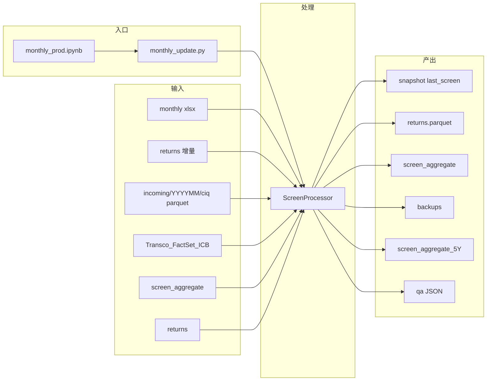

# Screen 月度数据流水线

将 FactSet 月度 Screen Excel、收益增量与 CIQ 历史补字段合并进统一主表：更新 `screen_aggregate.parquet`、`returns.parquet`，并回写风险与短期表现指标；同时生成 `last_screen.parquet`、时间戳备份、近 5 年子表 `screen_aggregate_5Y.parquet` 和 QA JSON。

> **数据文件**：`*.parquet`、Excel 映射与 `production_inputs/` 下的输入体积较大，通常不纳入版本库；下列路径为运行时的**目录约定**，需自行准备数据。

## 仓库结构

| 路径 | 说明 |
| --- | --- |
| `monthly_prod.ipynb` | 生产用笔记本，通常调用 `monthly_update.run_monthly_update()` |
| `monthly_update.py` | 命令行入口与 `run_monthly_update()` 实现 |
| `screen_func.py` | `ScreenProcessor` 等核心处理逻辑 |
| `Technicals.py` | 技术指标与风险相关计算（含可选 `numba` / `pandarallel`） |
| `screen_description.py` | 宽表字段的英文说明（参考） |
| `_quarantine_20260629/` | 已隔离的旧入口、旧输入和调试文件；只作为短期回滚参考 |
| `说明文档/` | 流程图、主表语义、字段字典等详细说明 |

## 环境与依赖

**建议 Python 3.9+**（按你当前环境即可）。

**必需（核心功能）**

```text
pandas
numpy
python-dateutil
```

说明：读写 Parquet 需引擎，推荐安装 `pyarrow`；读取 `.xlsx` 需 `openpyxl`。

**可选**

- `numba`：`Technicals.py` 中滚动波动率计算的加速路径  
- `pandarallel`：并行  
- `matplotlib`：部分作图（导入失败时仍可跳过）

一行示例（可按需删补）：

```bash
pip install pandas numpy python-dateutil pyarrow openpyxl
# 可选：pip install numba pandarallel matplotlib
```

## 数据目录约定

基目录默认为 **`monthly_update.py` 所在目录**（或通过 `--base-dir` 指定）。相对基目录：

| 类型 | 路径 | 说明 |
| --- | --- | --- |
| 月度 Screen | `production_inputs/incoming/YYYYMM/screen/*.xlsx` | 未指定 `--screen-excel` 时，取 `--input-month` 批次下最近修改的 `.xlsx` |
| 收益增量 | `production_inputs/incoming/YYYYMM/returns/` | 未指定 `--returns-delta` 时，取 `--input-month` 批次下最近修改的 Parquet（扩展名可为空或 `.parquet`） |
| 映射表 | `Transco_FactSet_ICB.xlsx` | FactSet / ICB 映射 |
| 历史主表 | `screen_aggregate.parquet` | 月度截面宽表历史 |
| 收益历史 | `returns.parquet` | 日频收益矩阵 |
| CIQ 历史补字段 | `production_inputs/incoming/YYYYMM/ciq/` | 未指定 `--ciq-dir` 时读取 `--input-month` 批次下所有文件；也可直接传单个 parquet 文件 |
| 最新单月快照 | `last_screen.parquet` | 最终主表里的最新月切片 |
| 备份 | `backups/screen_aggregate/screen_aggregate_YYYYMMDD_HHMMSS_<operation>.parquet` | 主表写入前自动备份；操作名区分 monthly / CIQ |
| QA 输出 | `qa/monthly_update_YYYYMMDD_HHMMSS_<month>.json` | 月更后自动生成的机器可读审计报告 |

输出主表时还会在同目录写入 **`screen_aggregate_5Y.parquet`**（近 5 年子集）。

## 运行方式

**命令行**（在项目根目录，且已准备好上述数据）：

```bash
python monthly_update.py
```

常用参数：

| 参数 | 含义 |
| --- | --- |
| `--base-dir` | 基目录；默认脚本所在目录 |
| `--input-month` | 生产输入批次，格式 `YYYYMM`；默认取 `production_inputs/incoming/` 下最新批次 |
| `--screen-excel` | 指定本次使用的 Screen Excel（否则自动选 input batch 的 `00_screen/` 最新 `.xlsx`） |
| `--returns-delta` | 指定本次收益增量文件（否则自动选 input batch 的 `returns/` 最新 parquet） |
| `--ciq-dir` | 指定 CIQ parquet 文件或目录；默认 input batch 的 `ciq/` |
| `--dry-run` | 只执行读取、合并和 QA 校验，不写入 canonical parquet |
| `--skip-ciq` | 跳过 CIQ 合并；只在明确不需要 CIQ 时使用 |
| `--qa-report` | 指定 QA JSON 输出路径；否则写入 `qa/` |
| `--update-mode` | `both`（默认）\|`screen_only`\|`returns_only` |

示例：

```bash
python monthly_update.py --update-mode both --input-month 202606
python monthly_update.py --update-mode both --input-month 202606 --dry-run
python monthly_update.py --update-mode returns_only --base-dir "D:\data\screen"
```

**笔记本**：打开 `monthly_prod.ipynb`，按单元格执行；内部与 CLI 调用同一套 `run_monthly_update()` 流程。

## 流程概览（简图）



## 延伸阅读

- [TP 文档中枢](../11_docs/README.md)
- [数据与生产流程](../11_docs/DATA_AND_PRODUCTION.md)
- [金融数据月更工作流与数据流](说明文档/monthly_update_workflow.md)  
- [`screen_aggregate` 与 `returns` 表语义、关联方式与空值说明](说明文档/screen_returns_context.md)  
- [Screen_Agg 字段字典](说明文档/Screen_Agg数据库字典.md)（若与当前 Parquet 列不一致，**以 live 数据为准**。）
