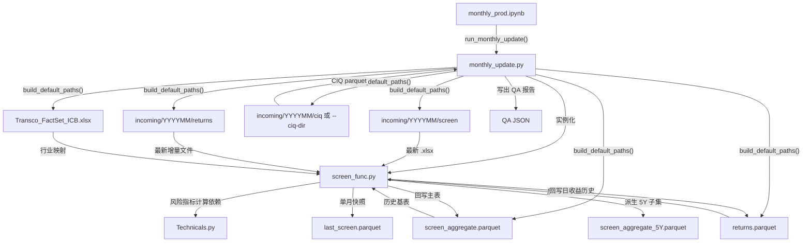

# Screen 月更工作流

本文档描述当前月更生产链路。最新 canonical 路径和数据契约请优先参考：

- `C:\GoogleDrive\TP\DATA_SOURCES.md`
- `C:\GoogleDrive\TP\DATA_CONTRACT.md`
- `C:\GoogleDrive\TP\11_docs\DATA_AND_PRODUCTION.md`

---

# 金融数据月更工作流结构图

## 1. 文件分层

```mermaid
flowchart TB
    subgraph inputs [输入层]
        monthlyExcel[production_inputs/incoming/YYYYMM/screen/*.xlsx]
        returnsDelta[production_inputs/incoming/YYYYMM/returns 最新增量]
        ciqInput[production_inputs/incoming/YYYYMM/ciq parquet 或 --ciq-dir]
        mappingExcel[Transco_FactSet_ICB.xlsx]
        returnsBase[returns.parquet]
        screenBase[screen_aggregate.parquet]
    end

    subgraph entry [入口层]
        notebook[monthly_prod.ipynb]
        cli[monthly_update.py]
    end

    subgraph service [处理层]
        processor[screen_func.py / ScreenProcessor]
        technicals[Technicals.py]
    end

    subgraph outputs [输出层]
        lastScreen[last_screen.parquet]
        returnsOut[returns.parquet]
        backupScreen[backups/screen_aggregate/screen_aggregate_YYYYMMDD_HHMMSS_operation.parquet]
        screenOut[screen_aggregate.parquet]
        screen5Y[screen_aggregate_5Y.parquet]
        qaReport[qa/monthly_update_*.json]
    end

    notebook --> cli
    cli --> processor
    processor --> technicals

    monthlyExcel --> processor
    mappingExcel --> processor
    returnsDelta --> processor
    ciqInput --> processor
    returnsBase --> processor
    screenBase --> processor

    processor --> lastScreen
    processor --> returnsOut
    processor --> backupScreen
    processor --> screenOut
    processor --> screen5Y
    processor --> qaReport
```

## 2. 运行时数据流

```mermaid
flowchart LR
    start[启动月更] --> resolveInputs[monthly_update.py 解析路径]
    resolveInputs --> pickScreen[识别最新 monthly Excel]
    resolveInputs --> pickReturns[识别最新 returns 增量]
    resolveInputs --> pickCiq[识别 CIQ 文件或目录]

    pickReturns --> mergeReturns[merge_returns_history]
    mergeReturns --> returnsUpdated[得到更新后的 returns.parquet]

    pickScreen --> readScreen[read_new_FS_screen]
    readScreen --> dedupIsin[按 ISIN 合并重复行]
    dedupIsin --> mapICB[FactSet_ICB_Mapping]
    mapICB --> monthDerived[补齐当月派生列]
    monthDerived --> saveLast[写出 last_screen.parquet]

    saveLast --> loadHistory[读取 screen_aggregate.parquet]
    loadHistory --> backupOld[create_backup]
    backupOld --> replaceMonth[merge_monthly_snapshot]

    returnsUpdated --> riskCalc[calculate_risk_metrics]
    replaceMonth --> riskCalc
    riskCalc --> riskMerge[prepare_risk_data_for_merge + merge_risk_data]

    returnsUpdated --> perfCalc[add_perf]
    riskMerge --> perfCalc

    perfCalc --> validate[validate_unique_keys on ISIN + Date]
    validate --> saveAll[save_results]
    saveAll --> ciqMerge[merge_ciq_history unless --skip-ciq]
    ciqMerge --> refreshDerived[刷新 last_screen 与 5Y]
    refreshDerived --> qaJson[build_monthly_qa_report + write_qa_report]
    qaJson --> finish[更新主表、派生表与 QA]
```

## 3. 文件互动关系

## 4. 关键文件说明

| 文件 | 角色 | 主要输入 | 主要输出 |
| --- | --- | --- | --- |
| `monthly_prod.ipynb` | 薄入口和人工检查面板 | `monthly_update.py` | 调用结果、简单校验视图 |
| `monthly_update.py` | 正式月更编排入口 | `production_inputs/incoming/YYYYMM/screen|returns|ciq/`、`screen_aggregate.parquet`、`returns.parquet`、`Transco_FactSet_ICB.xlsx` | 支持 `both / screen_only / returns_only`，编排 CIQ merge、派生输出刷新与 QA JSON |
| `screen_func.py` | 核心业务逻辑层 | 月度 Excel、历史 screen、历史 returns、mapping | `screen_aggregate.parquet`、`screen_aggregate_5Y.parquet`、风险/Perf 字段、时间戳备份文件 |
| `Technicals.py` | 风险技术指标计算层 | 更新后的 `returns` 与合并后的 `screen` | 波动率、VaR、回撤、Beta 系列 |
| `Transco_FactSet_ICB.xlsx` | 行业映射表 | FactSet 行业值 | ICB19/ICB11 编码与名称映射 |
| `screen_aggregate.parquet` | 历史月度主表 | 旧历史 + 新月度切片 | 更新后的完整历史主表 |
| `last_screen.parquet` | 最新单月快照 | 本月 Excel 处理结果 | 供下游其他分析或生产流程使用 |
| `returns.parquet` | 历史日频收益库 | 历史收益 + 最新增量收益 | 风险与 Perf 计算输入 |

## 5. 主要函数结构

### `monthly_update.py`

- `build_default_paths()`
  - 统一月更所需路径定义。
- `_resolve_screen_excel()`
  - 自动识别 `production_inputs/incoming/YYYYMM/screen/` 下最新的 `xlsx`。
- `_resolve_returns_delta()`
  - 自动识别 `production_inputs/incoming/YYYYMM/returns/` 下最新的增量文件。
- `_resolve_ciq_path()` / `_list_ciq_files()`
  - 识别 `--ciq-dir` 或默认 `production_inputs/incoming/YYYYMM/ciq/`，并在写主表前校验 CIQ 输入存在。
- `run_monthly_update()`
  - 串联整个月更流程，是当前正式入口。
  - 支持 `both`、`screen_only`、`returns_only` 三种模式。
  - 新增 `--ciq-dir`、`--skip-ciq`、`--qa-report`，使 CIQ 与 QA 可 CLI 化。
- `merge_ciq_history()`
  - 把 CIQ parquet 按 `(ISIN, Date)` 并入主表，只用 CIQ 补 screen 空值，不覆盖已有值。
- `build_monthly_qa_report()` / `write_qa_report()`
  - 生成机器可读 QA JSON，记录主键、SEDOL 覆盖、权重和、风险/Perf 非空率与 CIQ merge 证据。
- `main()`
  - 支持命令行运行。

### `screen_func.py`

- `get_latest_modified_file()`
  - 为入口层提供最新文件识别能力。
- `read_new_FS_screen()`
  - 读取月度 Excel。
  - 对重复 `ISIN` 做合并。
- `FactSet_ICB_Mapping()`
  - 把 FactSet 行业映射为统一 ICB 结构。
  - 同时标准化 `Date` 为月末。
- `validate_unique_keys()`
  - 用 `(ISIN, Date)` 做逻辑主键校验。
- `merge_returns_history()`
  - 合并历史 `returns.parquet` 和最新增量收益。
- `merge_monthly_snapshot()`
  - 用新月份切片替换历史中相同月份的数据。
- `add_score_multifacteur()`
  - 计算 `Multi Avg Percentile`。
- `rebalance_weight_sum_to_1()`
  - 将多个指数权重按月归一。
- `add_univ_ml()`
  - 生成 `Univ ML EU / US / OTHER` 权重列。
- `calculate_risk_metrics()`
  - 组合 `Technicals.py` 的风险函数。
- `prepare_risk_data_for_merge()` / `merge_risk_data()`
  - 把风险值变成长表并并回最新月度。
- `_build_perf_frame()` / `add_perf()`
  - 仅对目标月末日期计算 `Perf5D/1M/3M/6M`。
  - 不再全历史展开，避免高内存占用。
- `create_backup()` / `save_results()`
  - 负责时间戳备份和最终落盘。

### `Technicals.py`

- `add_bench_return()`
  - 计算并补入基准收益。
- `ewma_vol_window_rolling()`
  - 计算滚动波动率。
- `calculate_rolling_var()`
  - 计算滚动 VaR。
- `calculate_rolling_max_drawdown_series()`
  - 计算滚动最大回撤。
- `beta()` / `beta_up()` / `beta_down()`
  - 计算 Beta 系列指标。

## 6. 核心数据文件结构

### `screen_aggregate.parquet`

- 定位：历史月度主表。
- 粒度：单证券、单月末截面。
- 逻辑主键：`(ISIN, Date)`。
- 已知范围：
  - 约 `3399451` 行。
  - 约 `293` 列。
  - `315` 个按月截面。
  - `Date` 从 `1999-12-31` 到 `2026-02-28`。
- 列类型可按业务分成 6 类：
  - 标识字段：`ISIN`、`Company SEDOL`、`Symbol`。
  - 行业字段：`Benchmark ICB Supersector`、`Benchmark ICB Industry`、`ICB19 Supersector`。
  - 因子字段：`Growth Avg Percentile`、`Value Avg Percentile`、`Quality Avg Percentile` 等。
  - 指数权重字段：`Weight in MSCI WORLD`、`Weight in STOXX EUROPE 600`、`Weight in SP500` 等。
  - 风险字段：`Volatilite Rolling ewma 250D`、`VaR 1% Rolling 250D`、`Maximum Drawdown Rolling 250D`、`Beta ...`。
  - 表现字段：`Perf5D`、`Perf1M`、`Perf3M`、`Perf6M`。

### `returns.parquet`

- 定位：日频收益历史库。
- 粒度：单交易日、单 `Company SEDOL` 列。
- 行索引：交易日 `Date`。
- 列：大量证券 `SEDOL`。
- 用途：
  - 更新历史收益。
  - 作为风险指标和 Perf 指标的基础输入。

### `last_screen.parquet`

- 定位：最近一个月的单月快照。
- 粒度：单证券、单月末。
- 来源：主流程最终从 `screen_aggregate.parquet` 取最新月切片刷新，包含风险/Perf/CIQ 后的最终字段。
- 用途：供下游流程快速读取最新月度结果，不必每次加载全量 `screen_aggregate.parquet`。

## 7. 当前工作流的关键约束

- `monthly_update.py` 支持：
  - `both`：同时更新 `screen` 和 `returns`
  - `screen_only`：只更新 `screen`，沿用现有 `returns.parquet`
  - `returns_only`：只更新 `returns.parquet`，不触碰 `screen`
- 月更输入的 `monthly` Excel 必须只包含一个月末日期。
- 任何主表写回前都要通过 `(ISIN, Date)` 唯一键校验。
- 在 `both` 模式下，`returns` 更新先于风险与 Perf 计算。
- `Perf5D/1M/3M/6M` 只对目标月份增量计算，不再对全历史展开。
- `save_results()` 会同时维护：
  - `screen_aggregate.parquet`
  - `screen_aggregate_5Y.parquet`
- `create_backup()` 会先生成旧版历史主表备份，文件名包含 `YYYYMMDD_HHMMSS` 和操作名。
- 默认会执行 CIQ merge；只有明确使用 `--skip-ciq` 时跳过。
- 月更结束会生成 QA JSON，尤其检查 VaR/Beta 等风险字段是否存在和是否有最新月非空值。

## 8. 推荐阅读顺序

1. 先看 `monthly_update.py`
2. 再看 `screen_func.py` 中 `ScreenProcessor` 的核心处理方法
3. 最后看 `Technicals.py`
4. 需要人工执行时，再打开 `monthly_prod.ipynb` 的“正式月更入口”部分
