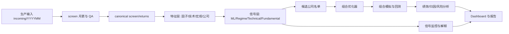

# TP 投资理财平台主线与项目整合计划

最后更新：2026-06-29  
状态：架构规划与整合路线图。P0 主线冻结、P1 能力入口收敛、P2 流水线第一版和 notebook 清理第一轮已落地；本文档仍保留后续路线。

## 1. 目标系统

`C:\GoogleDrive\TP` 最终应服务一个完整的投资理财生产链路：

1. 数据收集、清洗、月度更新和审计。
2. 数据展示、字段解释、数据质量监控。
3. 因子、技术指标、宏观/Regime、ML 和公司基本面信号生成。
4. 信号展示、信号监控、模型表现追踪。
5. 根据信号生成待选公司名单。
6. 对候选名单做组合权重优化。
7. 对组合进行模拟、回测、归因和压力测试。
8. 生成 dashboard、PDF/HTML 报告和最终投资建议材料。

核心原则：`00_screen/` 与 `01_tp_core/` 是底座；其他项目都应围绕同一套 canonical 数据和同一条生产主线组织。

## 2. 当前项目角色判断

| 层级 | 当前目录 | 建议角色 | 判断 |
| --- | --- | --- | --- |
| 数据底座 | `00_screen/` | canonical 数据生产层 | 保留并继续强化，是所有下游唯一数据源 |
| 共享库 | `01_tp_core/` | 数据路径、契约、IO、回测/优化共享逻辑 | 保留并扩展，应吸收重复工具函数 |
| 文档中枢 | `11_docs/` | 全局架构、数据规则、研究方法、治理 | 保留 |
| 回测主线 | `07_backtest_code/` | 传统代码版回测引擎、YAML 配置、批量运行和产物保存 | 保留为主线，不再维护独立 Web/GUI 前端 |
| 回测 Web/GUI 旧入口 | `99_archive/project_cleanup_20260707/99_backtest_web_app_legacy/`、`99_archive/project_cleanup_20260707/99_backtest_gui_legacy/` | 原 Streamlit/FastAPI/PySide6 入口和重复核心 | 已归档，只保留历史参考 |
| ML 主线 | `03_ml_enhanced/` | 当前主要 ML 信号生产候选 | 保留为主线，清理内部数据副本 |
| Regime | `03_regime_model/` | 市场状态、风险预算、配置建议 | 保留并接入信号层 |
| 技术信号 | `03_technical_analysis/` | 技术指标和形态信号生产 | 保留 V2，冻结 V1 |
| 公司展示 | `08_presentation_layer/legacy_apps/web_app_des_companies/` | 公司/行业/指数成分展示 | 已并入展示/报告层 |
| 公司分析 | `08_presentation_layer/legacy_apps/company_analysis/` | 公司研究、估值、模板 | 已并入展示/报告层；保留业务价值 |
| 报告脚本 | `08_presentation_layer/legacy_apps/dashboard_analysis/` | PDF/报告生成和组合分析脚本 | 已并入展示/报告层，不单独做数据源 |
| 组合优化 | `06_optimiser/` | Python 优化器候选 | 保留核心算法，合并 Excel/旧版 |
| 组合优化旧版 | `99_archive/project_cleanup_20260707/99_optimiseur_legacy/` | notebook/xlsm 旧界面 | 已归档，不做主线代码 |
| 旧 FactSet/Excel | `99_archive/frozen_20260629/factsetProd第一版/` | 历史生产链路参考 | 已冻结，不作为当前入口 |
| 旧回测 | `99_archive/frozen_20260629/backtest/`、`99_archive/frozen_20260629/回测第一版/` | 历史回测实现 | 已冻结；当前主线为 `07_backtest_code/` |
| 旧 ML | `99_archive/frozen_20260629/ML/`、`99_archive/frozen_20260629/ML第一版/` | 历史 ML 实现 | 已冻结，保留可追溯，不再作为生产 |
| 周期研究 | `99_archive/frozen_20260629/cyc/` | 周期/宏观早期研究 | 已冻结；有价值逻辑后续并入 `03_regime_model` |
| 小盘研究 | `99_archive/project_cleanup_20260707/12_small_cap/` | 小盘 universe/研究片段 | 已归档；后续如恢复，应并入候选池规则或正式研究文档 |

## 3. 明确重复和可合并项

### 3.1 回测重复

| 目录 | 问题 | 建议 |
| --- | --- | --- |
| `99_archive/frozen_20260629/backtest/` | `BacktestEngine.py` 与 `BacktestEngine - 副本.py` 内容完全相同 | 已冻结；如果还有有用逻辑，迁入 `tp_core.backtesting` |
| `99_archive/project_cleanup_20260707/99_backtest_web_app_legacy/_quarantine_20260629/legacy_backtest_core/BacktestEngine_original.py` | 仍保留 pickle 读取逻辑，是历史实现 | 已归档；当前入口使用 `backtest_code` / `tp_core.backtesting` |
| `技术分析和深度学习/技术分析_V1/backtest_core/` | 多个文件与旧 Web 回测 core 完全重复，例如 attribution、metrics、financial_filter、weight_manager | 删除或隔离 V1 的重复 core，只保留 V2 技术信号逻辑 |
| `回测第一版/` | 老 pickle/Excel 逻辑，与当前 parquet 主线冲突 | 冻结归档 |
| `99_archive/project_cleanup_20260707/99_backtest_gui_legacy/` | GUI 维护成本高，且与代码主线重复 | 已归档；无界面 runner/config 能力迁入 `backtest_code` |

### 3.2 ML 重复

| 目录 | 问题 | 建议 |
| --- | --- | --- |
| `ML/` | 上一版 ML，含大量 `.pkl` 数据和旧 notebook | 冻结归档，只保留必要历史输出 |
| `ML第一版/` | 第一代 ML，pickle 输出和旧 API | 冻结归档 |
| `03_ml_enhanced/` | 当前主线；原 `Input_files/` 的 00_screen/returns 副本、旧 `test_bench.ipynb`、旧 ptf 版 Monitoring 和 EM 参考 notebook 已隔离 | 保留代码；已建立 CLI 覆盖检查、显式 Score ML 生产和统一信号表导出 |
| `99_archive/frozen_20260629/技术分析和深度学习__深度学习/` | 与 ML_PIPELINE/ML_PREPROCESS/PREDICTOR 类功能重叠 | 已冻结；有价值部分后续迁到 `03_ml_enhanced` 或统一 `models/` |

### 3.3 数据副本重复

已经处理或仍需处理的较大非 canonical 数据副本：

| 位置 | 问题 | 建议 |
| --- | --- | --- |
| `03_ml_enhanced/Input_files/screen_aggregate.parquet` | 约 1.2GB，容易与 canonical 主表分叉 | 已隔离到 `03_ml_enhanced/_quarantine_20260629/legacy_data_copies/` |
| `03_ml_enhanced/Input_files/returns.parquet` | returns 副本 | 已隔离到 `03_ml_enhanced/_quarantine_20260629/legacy_data_copies/` |
| `03_ml_enhanced/test_bench.ipynb` | 旧实验 notebook，含写回主库的单元 | 已隔离到 `03_ml_enhanced/_quarantine_20260629/legacy_notebooks/` |
| `03_technical_analysis/data/screen_aggregate.parquet` | screen 副本 | 已隔离到 `03_technical_analysis/_quarantine_20260629/legacy_data_copies/` |
| `03_technical_analysis/data/returns.parquet` | returns 副本 | 已隔离到 `03_technical_analysis/_quarantine_20260629/legacy_data_copies/` |
| `ML/` 与 `03_ml_enhanced/` 中多个 `screen_ML_*.pkl` / `SCORE_ML_*.pkl` | 旧 pickle 格式和重复副本 | 后续先 manifest，再隔离旧版或统一转 parquet |

### 3.4 优化器重复

| 目录 | 问题 | 建议 |
| --- | --- | --- |
| `06_optimiser/` | Python 版组合优化主线 | 唯一入口为 `optimizer.py::optimize_portfolio()`，旧入口已删除 |
| `99_archive/project_cleanup_20260707/99_optimiseur_legacy/` | notebook + xlsm 版本 | 已归档，不作为生产 |
| `factsetProd第一版/func_optim_MAI.py` 与 `回测第一版/func_optim_MAI.py` | 内容完全重复 | 归档，不再维护两份 |
| `06_optimiser/sec_list_generation.py` 与 `回测第一版/sec_list_generation.py` | 内容完全重复 | 旧文件已归档；生产优化器入口为 `06_optimiser/optimizer.py` |

### 3.5 展示和报告重复

| 目录 | 问题 | 建议 |
| --- | --- | --- |
| `08_presentation_layer/legacy_apps/web_app_des_companies/` | 公司/行业/指数展示，结构相对清楚 | 已作为 presentation layer 内部实现保留 |
| `08_presentation_layer/legacy_apps/company_analysis/` | 公司分析和前端 | 已作为 presentation layer 内部实现保留 |
| `08_presentation_layer/legacy_apps/dashboard_analysis/` | PDF/report 和 dashboard 脚本 | 已作为 presentation layer 内部实现保留 |
| `03_regime_model/webapp/` | Regime 专属 dashboard | 可以作为统一投资 dashboard 的一个页面 |
| `99_archive/project_cleanup_20260707/99_backtest_web_app_legacy/` | 回测前端维护成本高 | 已归档；回测结果先以 `07_backtest_code/runs/` 产物供后续 dashboard 消费 |

## 4. 推荐目标架构

短期不必马上移动所有目录，但长期应向下面的逻辑结构靠拢：

```text
TP/
├── screen/                         # canonical 数据生产和月更
├── tp_core/                        # 共享库：IO、数据契约、信号、回测、优化、报告工具
├── pipelines/                      # 一键编排：月更、信号刷新、候选池、优化、回测、报告
├── models/
│   ├── ml/                         # 来自 ML_Enhanced 的生产化 ML 信号
│   ├── regime/                     # 来自 regime_model 的市场状态信号
│   └── technical/                  # 来自 technical_analysis_v2 的技术信号
├── optimizer/                      # 组合优化器和约束配置
├── apps/
│   ├── investment_dashboard/       # 总览：数据、信号、组合、回测、报告
│   ├── backtest_results/           # 消费 07_backtest_code/runs 的结果展示
│   └── company_research/           # 从 web_app_des_companies + Company_Analysis 演进
├── reports/                        # PDF/HTML 报告模板和生成脚本
├── docs/                           # 文档中枢
└── archive/                        # 冻结旧版本：ML、ML第一版、回测第一版、factsetProd第一版 等
```

如果暂时不想大规模改目录，至少要在现有结构中执行同样的职责边界：生产只读 `00_screen/`，共享逻辑只进 `01_tp_core/`，旧版本不再被新代码引用。

## 5. 投资理财主线流水线



### 5.1 数据层

主责目录：`00_screen/`、`01_tp_core/`。

产物：

- `screen_aggregate.parquet`
- `returns.parquet`
- `last_screen.parquet`
- QA JSON、输入 manifest、数据概况 profile

### 5.2 特征层

主责目录：`03_ml_enhanced/`、`03_regime_model/`、`03_technical_analysis/`、`08_presentation_layer/legacy_apps/company_analysis/`。

目标是统一输出表：

| 表 | 示例字段 |
| --- | --- |
| `factor_features` | Value、Quality、Growth、Momentum、Risk |
| `technical_features` | RSI、MACD、形态信号、趋势强弱 |
| `regime_features` | 当前市场状态、波动预测、风险预算系数 |
| `company_features` | 公司描述、新闻、估值、CIQ 基本面 |

### 5.3 信号层

已建立统一信号表第一版，不再让每个模型随意输出字段名。schema 见 `11_docs/SIGNAL_SCHEMA.md`：

| 字段 | 说明 |
| --- | --- |
| `Date` | 信号日期，月末或周末 |
| `Company SEDOL` / `ISIN` | 证券键 |
| `signal_family` | ML / Technical / Regime / Fundamental / Manual |
| `signal_name` | 具体信号名 |
| `score` | 原始分数 |
| `score_pct` | 横截面分位 |
| `direction` | 越高越好或越低越好 |
| `coverage_flag` | 是否可用 |
| `model_version` | 模型版本 |

### 5.4 候选池层

候选池不是回测结果，也不是最终组合；它应该是投资决策前的公司名单：

- universe：地区、指数、流动性、市值、ESG/黑名单。
- ranking：综合信号分数。
- constraints：行业、国家、风险、最大/最小持仓。
- explainability：入选原因、主要贡献信号、风险提示。

### 5.5 组合优化层

主责已经收敛到 `06_optimiser/optimizer.py::optimize_portfolio()`；旧
Excel/notebook 优化器保留在 archive 作为历史证据，活动 Python 入口、
package shim 和重复求解语义已删除。详细契约见
[`PORTFOLIO_OPTIMIZER.md`](PORTFOLIO_OPTIMIZER.md)。

目标能力：

- 输入候选名单、benchmark 权重、预期收益/信号分数、风险矩阵或 proxy。
- 支持最大权重、行业偏离、国家偏离、换手率、交易成本、持仓数量约束。
- 输出目标权重、交易清单、约束检查和优化日志。

### 5.6 回测与归因层

主责目录：`07_backtest_code/` + `tp_core.backtesting`。统一回测引擎细节见 [`BACKTEST_ENGINE.md`](BACKTEST_ENGINE.md)。

目标能力：

- 对候选池和优化权重做 point-in-time 回测。
- 对组合、benchmark、行业、因子、国家做归因。
- 输出标准绩效表、回撤、换手、hit rate、IC、风险暴露。

### 5.7 展示与报告层

主责目录：`08_presentation_layer/`。公司展示、公司分析和组合 dashboard/PDF 已迁入 `08_presentation_layer/legacy_apps/`；`03_regime_model/webapp` 后续可作为统一投资 dashboard 的一个页面。回测展示暂不维护独立前端，先消费 `07_backtest_code/runs/`。

已建立 `08_presentation_layer/` 作为展示/报告共享数据 repository。后续统一 dashboard 可按下面页面组演进：

| 页面 | 内容 |
| --- | --- |
| 数据健康 | 月更状态、QA、字段覆盖、returns 异常 |
| 市场状态 | Regime、波动预测、风险预算 |
| 信号监控 | ML/技术/基本面信号覆盖率、分布、漂移、IC |
| 候选名单 | 当前入选公司、解释、过滤原因 |
| 组合优化 | 目标权重、约束、交易、偏离 |
| 回测表现 | 净值、回撤、绩效指标、归因 |
| 公司研究 | 公司页面、新闻、估值、CIQ 摘要 |
| 报告生成 | PDF/HTML 月报、投资委员会材料 |

## 6. 分阶段路线图

### P0：先立主线，不再增加混乱

状态：已完成第一轮落地。

1. 旧目录已冻结到 `99_archive/frozen_20260629/`：`ML/`、`ML第一版/`、`回测第一版/`、`factsetProd第一版/`、`技术分析_V1/`。
2. 已建立冻结目录引用规则：`11_docs/LEGACY_POLICY.md` 和 `python -m tp_core.legacy_policy`。
3. `03_ml_enhanced/Input_files/` 和 `03_technical_analysis/data/` 中的 00_screen/returns 副本已隔离；旧 ML `.pkl`、旧 EM 参考 notebook 和项目派生快照后续按 manifest 再处理。
4. 回测主线已切到 `07_backtest_code/`；Web/API/GUI 前端入口与旧项目重复核心已隔离，`tp_core.backtesting` 暴露核心类。
5. 已建立统一信号表 schema：`tp_core.signals`、`11_docs/SIGNAL_SCHEMA.md`、`04_signals/` 输出目录。
6. 已建立编号索引并在 2026-07-07 并入 `11_docs/PROJECTS.md`，历史目录归档到 `99_archive/project_cleanup_20260707/00_项目主线索引/`。
7. 已完成 notebook 清理第一轮：根目录测试 notebook、早期 `backtest/`、早期 `cyc/`、旧深度学习 pipeline 已归档或冻结。

### P1：合并能力层

状态：已完成入口层收敛，模型内部生产化仍需继续。

1. ML 主线已固定 `python -m tp_models.ml.cli export-signals`，输出 `04_signals/ml_signals.parquet`；缺失月份 Score ML 可通过 `python -m tp_pipelines.refresh_ml` 显式生产，notebook 训练/监控研究流程后续再拆。
2. `regime_model` 已固定 `export_risk_budget.py`，输出 `04_signals/regime_risk_budget.parquet`。
3. `03_technical_analysis` 已固定 `export_technical_signals.py`，输出 `04_signals/technical_signals.parquet`；主回测逻辑收敛到 `backtest_code`。
4. `06_optimiser/optimizer.py::optimize_portfolio()` 是唯一 Python
   优化器标准；archive 中 notebook/xlsm 只留历史说明。
5. 已建立 `08_presentation_layer/` 共享数据 repository，并承载 `web_app_des_companies`、`Company_Analysis`、`dashboard_analysis` 的内部实现。

### P2：形成一键生产链路

状态：已建立第一版薄编排层。每个步骤都能单独运行、重跑和调试；标准产物使用固定 latest 路径覆盖写入，运行证据进入 `10_pipeline_runs/manifests/<step>/`。

```powershell
python -m tp_pipelines.refresh_data --input-month YYYYMM --update-mode both
python -m tp_pipelines.export_signals --as-of YYYY-MM-DD
python -m tp_pipelines.build_candidates --as-of YYYY-MM-DD
python -m tp_pipelines.optimize_portfolio --as-of YYYY-MM-DD
python -m tp_pipelines.run_backtest --inspect-only
python -m tp_pipelines.generate_report
python -m tp_pipelines.run_all --input-month YYYYMM --as-of YYYY-MM-DD
```

当前标准产物：

| 产物 | 路径 | 说明 |
| --- | --- | --- |
| 信号表 | `04_signals/*.parquet` | ML、Technical、Regime 统一 schema |
| 候选池 | `05_candidates/latest_candidates.parquet` | 由信号表生成的入选公司名单 |
| 目标权重 | `06_portfolios/latest_target_weights.parquet` | baseline 组合权重 |
| 流水线报告 | `09_reports/latest_pipeline_report.md` | 最新运行状态摘要 |
| 运行证据 | `10_pipeline_runs/manifests/` | 每步 latest 和时间戳 JSON manifest |

## 7. 建议的归档优先级

| 优先级 | 目录/内容 | 动作 |
| --- | --- | --- |
| 高 | `技术分析_V1/backtest_core` | 与 backtest 主线重复，先隔离或冻结 |
| 高 | `99_archive/frozen_20260629/backtest/BacktestEngine - 副本.py` | 完全重复 | 已冻结 |
| 已处理 | `99_backtest_web_app_legacy/`、`Backtest_GUI` GUI 入口和源码副本 | 已归档到 `99_archive/project_cleanup_20260707/`，主线改为 `backtest_code` |
| 高 | `03_ml_enhanced/Input_files/screen_aggregate.parquet`、`returns.parquet` | 已隔离，Monitoring/Pipeline 默认改为 `tp_core.data_sources` canonical 读取 |
| 高 | `03_technical_analysis/data/screen_aggregate.parquet`、`returns.parquet` | 已隔离，notebook 默认改为 canonical 读取 |
| 高 | `03_ml_enhanced/test_bench.ipynb` | 已隔离，避免旧实验单元误写主库 |
| 中 | `ML/`、`ML第一版/` | 已冻结到 `99_archive/frozen_20260629/` |
| 中 | `回测第一版/`、`factsetProd第一版/` | 已冻结到 `99_archive/frozen_20260629/` |
| 已处理 | `08_company_analysis/`、`08_dashboard_analysis/`、`08_web_app_des_companies/` 根目录并行展示项目 | 已迁入 `08_presentation_layer/legacy_apps/`，根目录不再保留三套展示/报告入口 |
| 已处理 | `06_optimiser/sec_list_generation.py` 与旧回测重复文件 | 旧文件已归档；现役入口为 `06_optimiser/optimizer.py` |
| 已处理 | `12_small_cap/`、`99_optimiseur_legacy/`、`99_backtest_gui_legacy/` | 已归档到 `99_archive/project_cleanup_20260707/` |
| 已完成 | `99_archive/frozen_20260629/cyc/` | 早期周期研究已冻结；有价值逻辑后续并入 `03_regime_model` |

## 8. 我的建议判断

最终主线不应该是“很多小项目并排存在”，而应该是：

- `screen` 负责可信数据。
- `tp_core` 负责共享规则和算法。
- `models` 或现有模型目录负责产生标准化信号。
- `optimizer` 负责把候选名单变成组合。
- `backtest` 能力只保留一套。
- `apps/reports` 负责把数据、信号、组合和表现讲清楚。
- 旧目录进入 archive，不参与新代码引用。

这样以后你做任何新想法，都可以先问：它是在数据层、信号层、候选池、优化、回测、展示还是报告层？只要归位清楚，项目就不会再散。
